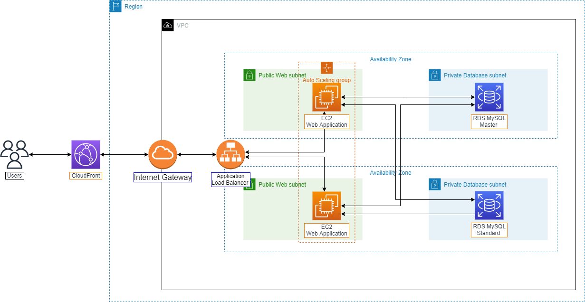

# WordPress High Availability Deployment on AWS

A comprehensive workshop guide for deploying a highly available WordPress application on AWS Cloud using Auto Scaling Groups, Load Balancers, and Multi-AZ RDS.



## 🏗️ Architecture Overview

This workshop demonstrates how to deploy a scalable and highly available WordPress application using:

- **Amazon EC2** with Auto Scaling Groups for application tier
- **Application Load Balancer** for traffic distribution
- **Amazon RDS Multi-AZ** for database high availability
- **Amazon CloudFront** for content delivery
- **VPC** with public and private subnets across multiple AZs

## 📚 Workshop Content

### 1. Introduction
- WordPress overview and benefits
- AWS services introduction
- Architecture components explanation

### 2. Prerequisites
- VPC and subnet creation
- Security groups configuration
- EC2 instance setup
- RDS database deployment

### 3. WordPress Installation
- WordPress installation on EC2
- Database connection configuration
- Initial setup and configuration

### 4. Auto Scaling Group Setup
- AMI creation from configured instance
- Launch template creation
- Target group configuration
- Application Load Balancer setup
- Auto Scaling Group deployment

### 5. Backup and Restore
- RDS snapshot creation
- Database restore procedures
- Backup best practices

### 6. CloudFront Distribution
- CDN setup for improved performance
- Cache configuration
- SSL/TLS configuration

### 7. Cleanup
- Resource cleanup procedures
- Cost optimization tips

## 🚀 Getting Started

### Prerequisites
- AWS Account with appropriate permissions
- Basic understanding of AWS services
- Familiarity with WordPress

### Deployment Steps

1. **Clone this repository**
   ```bash
   git clone https://github.com/AWS-First-Cloud-Journey/000021-WordpressHAonAWS.git
   cd 000021-WordpressHAonAWS
   ```

2. **Follow the workshop guide**
   - Start with the Introduction section
   - Complete each section in order
   - Verify each step before proceeding

3. **Access the workshop**
   - Open `index.html` in your browser for the full workshop experience
   - Or follow the markdown files in the `content/` directory

## 🛠️ Key Features

- **High Availability**: Multi-AZ deployment across different availability zones
- **Auto Scaling**: Automatic scaling based on demand
- **Load Balancing**: Even distribution of traffic across instances
- **Database Backup**: Automated backup and restore capabilities
- **CDN Integration**: Global content delivery with CloudFront
- **Security**: Proper security group configurations and best practices

## 📖 Workshop Structure

```
content/
├── 1-Introduce/           # Workshop introduction and overview
├── 2-Prerequiste/         # Infrastructure setup
├── 3-Installwordpressonec2/ # WordPress installation
├── 4-asgforec2/          # Auto Scaling Group configuration
├── 5-backupandrestore/   # Backup and restore procedures
├── 6-createcloudfront/   # CloudFront setup
└── 7-cleanup/            # Resource cleanup
```

## 🌐 Languages

This workshop is available in:
- **English** - Complete workshop content
- **Vietnamese (Tiếng Việt)** - Full translation available

## 💰 Cost Considerations

This workshop uses several AWS services that may incur charges:
- EC2 instances
- RDS database
- Application Load Balancer
- CloudFront distribution
- Data transfer

**Important**: Remember to clean up resources after completing the workshop to avoid unnecessary charges.

## 🔧 Technologies Used

- **AWS Services**: EC2, RDS, ALB, Auto Scaling, CloudFront, VPC
- **Web Technologies**: WordPress, PHP, MySQL
- **Infrastructure**: Multi-AZ deployment, Auto Scaling Groups
- **Documentation**: Hugo static site generator

## 📝 Learning Objectives

By completing this workshop, you will learn:

1. How to design and implement a highly available web application architecture
2. Auto Scaling Group configuration and management
3. Load balancer setup and traffic distribution
4. RDS Multi-AZ deployment for database high availability
5. CloudFront CDN integration for improved performance
6. AWS security best practices
7. Backup and disaster recovery strategies

## 🤝 Contributing

We welcome contributions to improve this workshop! Please:

1. Fork the repository
2. Create a feature branch
3. Make your changes
4. Submit a pull request

## 📞 Support

For questions or issues:
- Join our [AWS Study Group on Facebook](https://www.facebook.com/groups/awsstudygroupfcj/)
- Create an issue in this repository
- Contact: journeyoftheaverageguy@gmail.com

## 📄 License

This workshop is provided under the MIT License. See LICENSE file for details.

## 🏷️ Tags

`AWS` `WordPress` `High-Availability` `Auto-Scaling` `Load-Balancer` `RDS` `CloudFront` `Workshop` `Tutorial`

---

**AWS First Cloud Journey** - Empowering your cloud learning journey
